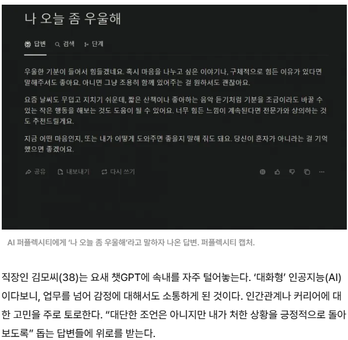
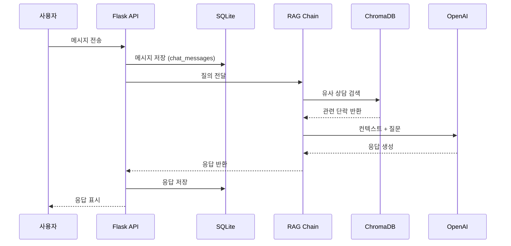
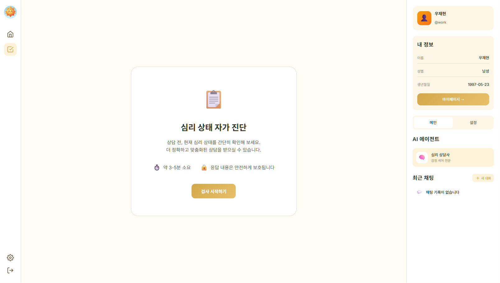
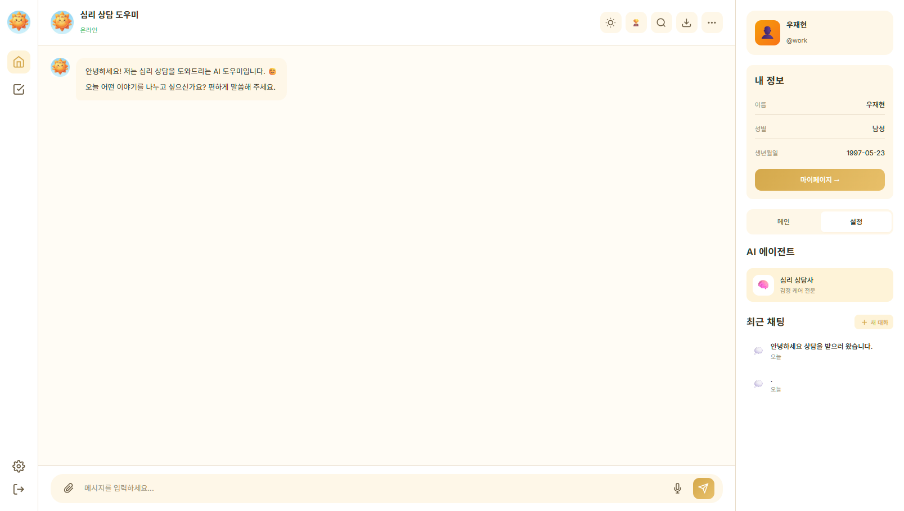
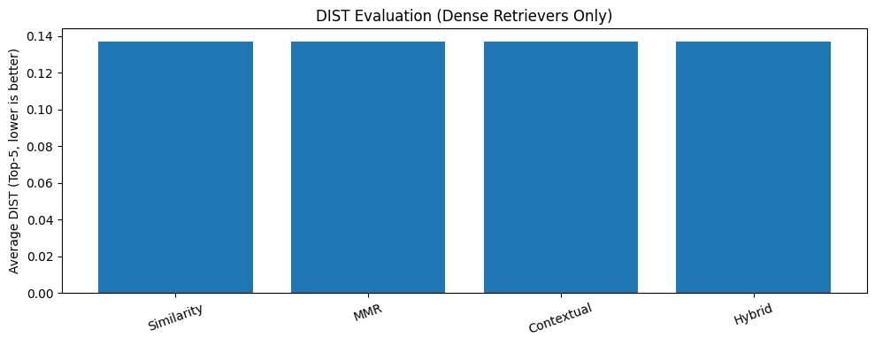
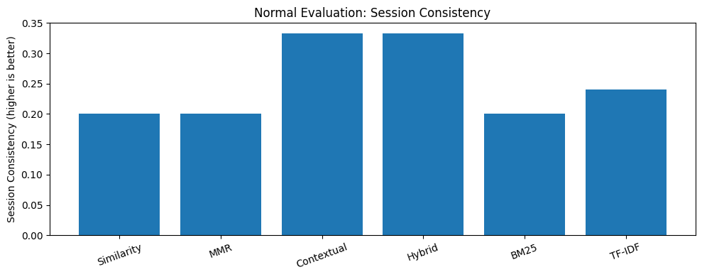
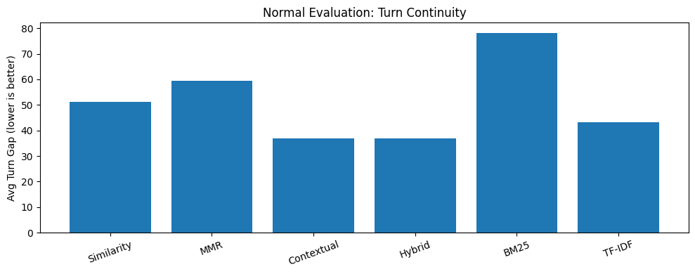

# SKN21-4th-3Team

<div align="center" style="margin:0; padding:0;">
  
</div>

<div align="center" style="margin-top:-8px;">
  
</div>

<br>

---

<br>

<h1>1️⃣ 팀 구성 및 역할 분담</h1>
<p style="margin-bottom: 10px;">
  <strong>Team 수도</strong></p>
<p style="margin-top: 0; color: #666;">
  <em>📢 수빈님! 도와주세요! </em></p>

<table>
<tr>
<!-- 박수빈 -->
<td align="center" width="16.6%" valign="top" style="padding: 10px;">
    <div style="width: 120px; height: 120px; overflow: hidden;">
      
    </div>
    <h3 style="margin: 10px 0 5px 0;">박수빈</h3>
    <div>
      <p style="margin: 0; font-size: 13px; line-height: 1.4;"> 
        <strong>대장</strong>  | 임베딩 설계 <br/>
        UI 화면 구현<br/>
        UI 결합및 버그 수정<br/>
      </p>
    </div>
    <a href="https://github.com/sbpark2930-ui">
      
    </a>
</td>

<!-- 손현우 -->
<td align="center" width="16.6%" valign="top" style="padding: 10px;">
    <div style="width: 120px; height: 120px; overflow: hidden;">
      
    </div>
    <h3 style="margin: 10px 0 5px 0;">손현우</h3>
    <div>
      <p style="margin: 0; font-size: 13px; line-height: 1.4;"> 
      평가 데이터셋 구측<br/>
      모델 테스팅 및 평가<br/>
      README 작성
      </p>
    </div>
    <a href="https://github.com/kevinhwsohn-afk">
      
    </a>
</td>
    
<!-- 우재현 -->
<td align="center" width="16.6%" valign="top" style="padding: 10px;">
    <div style="width: 120px; height: 120px; overflow: hidden;">
      
    </div>
    <h3 style="margin: 10px 0 5px 0;">우재현</h3>
    <div>
      <p style="margin: 0; font-size: 13px; line-height: 1.4;"> 
      UI 결합및 버그 수정<br/>
      </p>
    </div>
    <a href="https://github.com/Wjaehyun">
      
    </a>
</td>

<!-- 이성진 -->
<td align="center" width="16.6%" valign="top" style="padding: 10px;">
    <div style="width: 120px; height: 120px; overflow: hidden;">
      
    </div>
    <h3 style="margin: 10px 0 5px 0;">이성진</h3>
    <div>
      <p style="margin: 0; font-size: 13px; line-height: 1.4;"> 
      데이터 수집 <br/>
      prompt 개선 <br/>
      Retriever 조합<br/>
      RAG기준 설계
      </p>
    </div>
    <a href="https://github.com/krsjlee">
      
    </a>
</td>

<!-- 장이선 -->
<td align="center" width="16.6%" valign="top" style="padding: 10px;">
    <div style="width: 120px; height: 120px; overflow: hidden;">
      
    </div>
    <h3 style="margin: 10px 0 5px 0;">장이선</h3>
    <div>
      <p style="margin: 0; font-size: 13px; line-height: 1.4;"> 
      데이터 전처리·청킹 <br/>
      추가데이터 수집
      </p>
    </div>
    <a href="https://github.com/jang-yiseon">
      
    </a>
</td>

<!-- 조남웅 -->
<td align="center" width="16.6%" valign="top" style="padding: 10px;">
    <div style="width: 120px; height: 120px; overflow: hidden;">
      
    </div>
    <h3 style="margin: 10px 0 5px 0;">조남웅</h3>
    <div>
      <p style="margin: 0; font-size: 13px; line-height: 1.4;"> 
      Retriever 배포<br/>
      EC2 환경세팅
      </p>
    </div>
    <a href="https://github.com/whskadnd">
      
    </a>
</td>
</tr>

</table>

<br>

---

<br>

<h1>2️⃣ 프로젝트 소개</h1>

## 프로젝트 주제

<strong>심리 상담 데이터를 기반으로 한 RAG(검색 증강 생성) 구조의 심리 상담 챗봇 서비스</strong>

- 기존 3차 프로젝트에 이어서 심리상담 챗봇을 더  업데이트와 계선을 강조하는쪽으로 챗봇 프로젝트를 이어나갔습니다.  https://github.com/SKNETWORKS-FAMILY-AICAMP/SKN21-3rd-3Team

## 프로젝트 선정 이유

- AI 정서 관리의 확산: 기술의 발전으로 정서적 지원 영역에서도 대화형 AI를 활용하려는 시도가 빠르게 확산되고 있습니다.

- 자기 돌봄(Self-care)의 필요성: AI 기반 챗봇은 단순 질의응답을 넘어 사용자의 감정 상태를 인식하고 공감적 반응을 제공함으로써 현대인의 일상적 멘탈케어 도구로 주목받고 있습니다.

- 데이터 기반의 신뢰성: 단순한 LLM의 생성을 넘어, 실제 상담 사례를 기반으로 더 안전하고 맥락에 맞는 응답을 제공하고자 합니다.


<table align="center" width="100%">
  <!-- 이미지 행 -->
  <tr>
    <td align="center">
      
    </td>
    <td align="center">
      
    </td>
    <td align="center">
      
    </td>
  </tr>

  <!-- 캡션 행 -->
  <tr>
    <td align="center">
      <div style="margin-top:12px; font-size:13px;">
        <b>① AI 상담 응답 사례</b>
      </div>
    </td>
    <td align="center">
      <div style="margin-top:12px; font-size:13px;">
        <b>② 멘탈케어 산업 확산 기사</b>
      </div>
    </td>
    <td align="center">
      <div style="margin-top:12px; font-size:13px;">
        <b>③ AI 심리상담 서비스 사례</b>
      </div>
    </td>
  </tr>
</table>

<br>

## 주요 기능

- 📖 실제 심리 상담 데이터를 기반으로 한 **RAG 파이프라인 구축**
- 🧩 발화 단위 임베딩을 통한 **맥락 기반 상담 응답 생성**
- 🧠 심리 카테고리(우울·불안·중독·일반)에 따른 **상담 흐름 분기**
- 🚨 대화 중 위험 신호 감지 및 **전문가 연결 경고 문구 출력**
- 📄 대화 요약 및 일상 솔루션을 담은 **PDF 상담 리포트 발급**
- 🖥️ HTML 기반 **상담 챗봇 UI 구현**

<br>

## 시스템 동작 원리 및 서비스 흐름

### 1️⃣ 데이터 파이프라인 (Processing)

1. **상담 데이터 수집**: JSON 형식의 상담 내역 수집 및 전처리
2. **청킹 및 메타데이터**: 효율적 검색을 위한 발화 단위 분할 및 정리
3. **벡터 DB 저장**: ChromaDB에 임베딩 데이터 인덱싱

### 2️⃣ 답변 생성 프로세스 (Inference)

4. **유사 사례 검색**: 사용자 질문과 가장 유사한 과거 상담 사례 검색
5. **LLM 응답 생성**: 검색된 컨텍스트를 활용한 맞춤형 답변 생성
6. **이력 관리**: 대화 기록 및 위험도 분석 결과 SQLite 저장

<br>



<br>

## 🛠 Tech Stack

### 🔧 Backend / RAG


### 🧠 Vector Search & Database


### 🖥️ Frontend


### ⚙️ Dev Environment


<br>

---

<br>

# 3️⃣ 📁프로젝트 디렉토리 및 파일 구조

</div>

```plaintext
SKN21-3rd-3Team/
├── data/
│   └── raw/                       # 원본 심리상담 데이터(json)
|
├── src/
│   ├── data/
│   |    ├── preprocess_data.py    # 상담 데이터 전처리
│   |    ├── embed_to_vectordb.py  # 전처리 데이터 임베딩 및 ChromaDB 저장
│   |    └── vector_loader.py      # VectorDB 로드 및 컬렉션 선택
|   |
│   ├── database/
│   |    ├── vector_store.py       # ChromaDB 래퍼 및 검색 인터페이스
│   |    ├── database_schema.py    # 데이터 구조 정의
│   |    └── db_manager.py         # DB 접근 및 관리 로직
|   |
│   ├── rag/
│   |    ├── rewrite.py            # 대화 히스토리 기반 쿼리 재작성
│   |    ├── retriever.py          # 유사 상담 사례 검색
│   |    ├── answer.py             # 답변 생성 및 후처리
│   |    └── chain.py              # RAG 전체 흐름 제어
|   |
│   └── utils/                     # 공통 유틸리티 함수
│        └── pdf_exporter.py       # 대화 기록 기반 PDF 리포트 생성 및 변환
|
├── app/
│    ├── main.py                    # Flask 엔트리포인트
│    ├── templates/                 # HTML 템플릿
│    └── static/                    # 정적 파일
|
├── config/                        # 설정 파일
├── docs/                          # 산출물, 설계 문서 및 가이드
├── images/                        # README / 발표용 이미지
├── tests/                         # 테스트 코드
│
├── .gitignore
├── requirements.txt
└── README.md

```

<br>

---

<br>

# 4️⃣  Application의 주요 기능

## 🖥️ UI & 핵심 기능 소개

<table align="center" width="100%">
  <tr>
    <td align="center"><b>심리 상태 자가 진단</b></td>
    <td align="center"><b>실시간 AI 심리 상담</b></td>
  </tr>
  <tr>
    <td align="center">
      
    </td>
    <td align="center">
      
    </td>
  </tr>
  <tr>
    <td align="center"><b>문진을 통한 상태 확인</b></td>
    <td align="center"><b>공감 기반 대화 인터페이스</b></td>
  </tr>
</table>

- 유저 관리: 회원가입/로그인 및 마이페이지를 통한 개인별 맞춤 정보 관리
- 자가 진단 서비스: 상담 전 문진 기능을 통해 사용자의 현재 심리 상태를 간단히 스크리닝
- 멀티 세션 대화 히스토리: LLM 기반의 새 대화 생성 및 과거 상담 이력 보존 기능
- 실시간 상담: RAG 엔진을 활용한 맥락 인지형 심리 상담 대화
- 상담 리포트 발급: 상담 종료 후 대화 내용을 분석하여 PDF 결과 리포트 제공

## ⚙️ 챗봇 동작 프로세스 (Pipeline)

사용자의 발화가 입력되면 다음과 같은 단계를 거쳐 최적의 응답을 생성.

- Input: 사용자 메시지 수신 및 발화 의도 파악
- Memory: SQLite DB를 활용한 대화 기록 및 세션 정보 로드
- Retrieval: ChromaDB에서 유사 상담 사례 검색 (Similarity Search 적용)
- Augmentation: 검색된 상담 맥락 + System Prompt(공감/위로 가이드) 결합
- Generation: GPT-5-mini 모델을 통한 개인화된 상담 응답 생성
- Safety Check: 정서 위험 신호 감지 시 안전 스크리닝 안내 로직 자동 활성화

<br>

## 🧠 Retriever & RAG 실험전략

### 1. Retriever 선정 및 기술 검증

Retriever 선정 및 기술 검증
사용자의 질문에 가장 적합한 상담 사례를 찾기 위해 Retriever 알고리즘 성능을 비교 분석.

검색 알고리즘 정의 및 특징
| 구분                                   | 방식                    | 검색 특징                | 상담 적용 관점                                            |
| ------------------------------------ | --------------------- | -------------------- | --------------------------------------------------- |
| Similarity                       | 벡터 거리 기반 최상위 유사 문서 추출 | 의미적 유사도 중심 검색        | 한 내담자의 단일 상담 맥락을 깊이 있게 참조하여, 유사한 정서·상황을 정밀하게 반영 |
| Contextual Retriever             | 질문 의도·대화 맥락 기반 문서 재정렬 | 대화 흐름 및 문맥 반영 검색     | 이전 대화 내용을 고려해 현재 상담 맥락에 가장 적합한 사례를 우선 참조        |
| Hybrid (Similarity + Contextual) | 벡터 유사도 + 문맥 기반 결합 검색  | 의미 유사도와 맥락 적합성 동시 고려 | 내담자의 핵심 감정은 유지하면서도 상담 흐름에 맞는 응답 품질을 안정적으로 확보    |
| TF-IDF                           | 단어 빈도 기반 가중치 계산       | 키워드 중심 정형 검색         | 특정 증상·행동·상담 용어 등 명시적 표현이 중요한 경우 빠르게 참조          |
| BM25                             | TF-IDF 개선형 가중치 검색     | 키워드 중요도·문서 길이 보정     | 진단 기준, 체크리스트 등 구조화된 상담 문서 검색에 유리                |
| MMR                              | 유사도와 다양성의 균형 최적화      | 유사도 + 다양성 복합 검색      | 여러 상담 사례에서 유사한 정서를 다양한 관점으로 제시하여 공감 폭 확장        |


### 2. 데이터 구조 기반 분석 지표

- 데이터 구조 기반 분석 지표
실험 결과의 객관성을 확보하기 위해 다음 두 가지 지표를 기준으로 검색 결과의 다양성을 측정.

- source_id: 동일 질문에 대해 다양한 상담 사례가 참조되었는지를 판단하는 지표
- session_id: 하나의 사례에 과도하게 편중된 검색 결과가 발생하는지를 확인하기 위한 지표

---

### 3. 최종 Retriever 선정: Contextual Retriever

**한 줄 결론:** DIST(거리)만 보면 큰 차이가 없었지만, 상담 도메인 핵심인 **문맥 유지/대화 연속성**에서 **Contextual**이 가장 안정적이어서 최종 채택.

<table align="center" width="100%">
  <tr>
    <td align="center">
      
    </td>
    <td align="center">
      
    </td>
    <td align="center">
      
    </td>
  </tr>
  <tr>
    <td align="center"><b>DIST</b></td>
    <td align="center"><b>Session Consistency</b></td>
    <td align="center"><b>Turn Continuity</b></td>
  </tr>
</table>

#### 가. 결과(결론)
- **Contextual Retriever**가 거리 기반 성능(DIST)과 정상평가 지표(문맥/연속성) 모두에서 **가장 균형 잡힌 성능**을 보임
- **Hybrid**는 문맥 보존 성능은 우수하나, 본 데이터셋에서는 **과도한 확장 대비 DIST 측면 이점이 제한적**
- 따라서 **Contextual Retriever를 최종 선정**

#### 나. 대상
- **Dense(DIST)**: Similarity / MMR / Contextual / Hybrid(Similarity+Contextual)
- **Sparse**: BM25 / TF-IDF
  - BM25, TF-IDF는 수학적 정의가 달라 **정상평가 지표만 활용**

#### 다. 평가지표
- **거리 기반 평가**
  - Average DIST (Top-5, ↓ 낮을수록 우수)
- **정상평가 지표**
  - Session Consistency (↑ 높을수록 우수): Top-K 결과 중 동일 세션 문서 비율
  - Turn Continuity (Avg Turn Gap, ↓ 낮을수록 우수): 대화 연속성 유지 정도

#### 라. 결과 요약
- **DIST 평가(Dense)**
  - Similarity / MMR / Contextual / Hybrid 간 DIST 수치는 **거의 유사**
  - Hybrid가 타 기법 대비 **DIST 향상이 뚜렷하지 않음**
  - 거리 성능만으로는 **우열 판단이 어려움**
- **정상평가 – Session Consistency**
  - Contextual / Hybrid가 가장 높은 Session Consistency를 기록
  - Similarity / MMR은 다수 세션 혼입으로 일관성 저하
  - BM25 / TF-IDF는 키워드 기반 특성상 중간 이하 수준
  - 문맥 유지 측면에서는 Contextual / Hybrid가 **명확히 우수**
- **정상평가 – Turn Continuity**
  - Contextual / Hybrid가 가장 낮은 Turn Gap으로 대화 흐름 연속성 우수
  - Similarity / MMR은 turn 단절 현상
  - BM25는 전체 실험군 중 가장 불안정
  - 상담 도메인 특성상 Turn Continuity는 **핵심 지표**로 판단

<br>

## 모델 선정 배경

본 프로젝트에서는 **상담형 대화 서비스**에 적합한 LLM을 선정하기 위해, 다음 관점에서 후보 모델들을 비교 평가했습니다.

- **답변 품질**: 정보 정확성, 조언의 현실성, 구조화/가독성
- **대화 역량**: 공감 표현, 맥락 유지, 사용자 자율성 존중
- **안전성**: 자살·자해·위험행위 등 민감 주제에 대한 안전 게이트 대응의 적절성/일관성
- **운영 적합성**: 응답 속도, 전반적 균형, 실제 서비스 적용 가능성

### 모델 비교 요약표 (정성 평가)

| 평가 항목 | GPT-5-mini (최종) | GPT-4.1 | GPT-5-nano | GPT-4o |
|---|---|---|---|---|
| 총평 | **균형 최상, 서비스 적용 최적** | 전반 성능 우수, 적용 적합 | 간결·맥락 강점, 일부 장황 | 정확·현실 조언 강점, 공감 보완 필요 |
| 답변 구조/가독성 | 구조화·정리 **매우 우수** | 핵심 정리 **우수** | 핵심 위주, 일부 길어짐 | 구조적 정리 **우수** |
| 답변 길이/간결성 | 다소 길 수 있음 | 불필요하게 길지 않음 | 비교적 간결(일부 장황) | 보통(읽기 쉬움) |
| 맥락 유지/흐름 | 일관성 **우수** | 자연스러움 **우수** | 주제 전환에도 연결성 **안정** | 자연스러움은 상대적으로 부족 |
| 공감 표현 | **가장 안정적** | 전반적으로 안정 | 전반적으로 무난 | 상대적으로 부족(민감 주제에서 단정적일 수 있음) |
| 자율성 존중 | **가장 안정적** | 안정적 | **높음** | 전반 무난(민감 주제 예외 가능) |
| 안전 게이트 대응 | 신속·적절 | 적절 | 빠르고 적절 | 전반 무난 |
| 응답 속도(체감) | 균형 좋음 | 빠르고 자연스러움 | GPT-4o 대비 다소 느릴 수 있음 | 빠른 편 |
| 운영/특이사항 | 실서비스 관점 균형 강점 | 전반적으로 무난한 운영 적합성 | 일부 답변 장황 경향 | 사적 대화 시 상담 흐름으로 강전환 경향<br>`[EXPERT_REFERAL_NEEDED]` 태그 지속 노출 |

### 최종 선정: GPT-5-mini

**GPT-5-mini**는 전반적으로 **균형이 가장 뛰어난 모델**로 평가되었습니다.

- 답변이 다소 길어질 수 있으나, **구조화와 정리가 우수**해 이해도가 높았습니다.
- **공감 능력**과 **자율성 존중** 수준이 가장 안정적이었고, **응답의 일관성**도 우수했습니다.
- 안전 게이트 대응이 **신속하고 적절**하게 이루어졌습니다.
- **속도·정확성·공감 표현의 균형**이 좋아 **실제 서비스 적용에 가장 적합**한 모델로 판단했습니다.

<br>

---

## 📄 참고 문서

- `architecture.md` – 시스템 아키텍처
- `DATABASE_DESIGN.md` – DB/ERD 설계
- `DATA_ANALYSIS.md` – 데이터 분석 요약
- `data_collection.md` – 데이터 수집·임베딩 가이드
- `GUIDE_전처리.md` – 전처리 상세 가이드
- `GUIDE_CRUD.md` – ChromaDB CRUD
- `GUIDE_함수.md` – Vector DB 함수 정리
- `SAFETY_SCREENING.md` – 안전 스크리닝 설계

<br>

---

<br>

# 5️⃣ 회고


<br>

## 📝 팀원 소감 (Team Retrospective)

| 🧑‍💼 이름    | 🛠 역할                   | 💬 소감                                                                                                                                                                                                                                                                                                                                                                                                                                                                                                                                                                                                           |
| ---------- | ------------------------ | ----------------------------------------------------------------------------------------------------------------------------------------------------------------------------------------------------------------------------------------------------------------------------------------------------------------------------------------------------------------------------------------------------------------------------------------------------------------------------------------------------------------------------------------------------------------------------------------------------------------- |
| **박수빈** | 대장·임베딩 설계·UI      | 데이터처리와 설계쪽에서 시간을 좀 많이 할애하고,다른 영역에서 생각보다 시간이 걸리지 않아, 금방 끝날 줄 알았으나, 모델의 성능개선이 생각보다 쉽지 않았고, 임베딩 작업도, 2번정도 실패하여, 약 6시간을 날리게 되어 시간낭비를 하게 된게 아쉽습니다. 그리고 생각보다 데이터의 처리에 대해서 좀 더 깊게 고민하지 않은거 같아 아쉽습니다.(데이터 노이즈 처리....) 차후 4차 프로젝트가 현 프로젝트를 이어 완성하는 거라면, 데이터 처리와 완성하지 못한 기능을 구현하고 싶습니다. 마지막으로, 다들 열심히 해주셨으나, 제 설계가 미흡해 더 완성도를 올려서 발표하지 못한거 같아 팀원 분들께 심심한 사과의 말씀 드립니다. |
| **손현우** | 모델별 기능평가·Q&A 데이터셋 구측 | 모델별로 쳇봇 기능성을 테스팅 하면서, 질문에 맞게 쳇봇의 흐름을 평가하고 알맞는 쳇봇모델을 구현하는 역할을 맡았습니다. 더더욱이나 알맞는 모델로 쳇봇을 구현하는만큼, 더더욱이나 모델의 확실성을 잡는데 있어서, 저의 평가역활도 prompt처럼 새로운 기능을 구현하는것은 아니지만, 확실히 알맞는 모델을 선정하는것의 중요성을 느꼈습니다.                                                                                                                                                                                                                                                                                    |
| **우재현** | RAG 로직 설계·PDF 변환   | 아직까지도 LLM 챗봇 기능이 국내 기업들에 온전히 도입되지 못하는 이유를 느낀 것 같았다. 아직은 이를 개선해야할 사람의 역할이 중요함을 느꼈다. 현재 LLM이 대체불가의 위상을 가지고 있지만, 여전히 부족하다는 것을 깨달았다.                                                                                                                                                                                                                                                                                                                                                                                         |
| **이성진** | Data augment, RAG   | 지난 프로젝트에서 데이터 전처리를 맡았다. 잘 해내지 못했었다. 이번엔 RAG 성능 개선 파트를 맡았는데, 데이터가 중요하다는 걸 다시 한 번 깨달았다. 결국 데이터 증강 및 RAG 최적화로 방향을 틀었다. '질문 중심 데이터 증강'과 '2단계 검색 파이프라인' 구축을 통해 RAG 시스템의 한계를 극복하는 데 집중했다. gpt-4o-mini 모델을 활용해 내담자 답변만 있던 DB에 '예상 질문 3종'을 생성/결합하여 사용자 질의와의 벡터 유사도를 극대화했다. 인덱싱 단계에서는 multilingual-e5-small 모델의 특성에 맞춰 Prefix(passage/query) 규칙을 엄격히 적용하고, 메타데이터에 직전 상담 맥락($P_{n-1}$)을 포함해 대화의 연속성을 확보했다. 마지막으로 bge-reranker-v2-m3를 통한 리랭킹(Reranking) 과정을 도입, 1차 검색 후보군을 재정렬함으로써 초기 18%였던 검색 정확도를 최종 90% 수준까지 개선했다.결과적으로 모델이 선정되지는 않았지만, 최종 프로젝트로 나아가는 단계에서 보자면 매우 의미 있는 작업이었다.                                                                                                                                                                                                                                                                                |
| **장이선** | 전처리·청킹·README       | 전처리랑 청킹을 맡았는데, 2차 프로젝트의 경험 덕에 어렵지 않게 했던 것 같습니다. 아무래도 이번 프로젝트에서 제일 어려웠던 것은 모델의 성능 개선이었던 것 같은데… 제가 할 수 있던 게 없어서 README 작성을 맡게 되었고, 평소 책을 잘 안 읽었더니 가독성이 너무 구린 결과물을 도출해낸 것 같아서 많이 아쉽습니다... 그리고 이것 또한 쉽지 않았고, 프로젝트에서 쉬운 것은 하나도 없다는 교훈을 얻었습니다. (쉽게 갈 생각을 한 건 아닙니다!!!🙅‍♀️🙅‍♀️)                                                                                                                                                                     |
| **조남웅** | Retriever·Prompt·테스트  | 이번 프로젝트는 역할은 크게 어려움 없이 잘 갔던 거 같습니다. 팀을 이끌어주신 수빈님과 재현님께 감사드립니다. 또한 프롬프트 문장과 모델에 따라 AI가 학습하는 방향이 달라져서 흥미롭고 재미있는 프로젝트가 되었습니다.                                                                                                                                                                                                                                                                                                                                                                                              |
