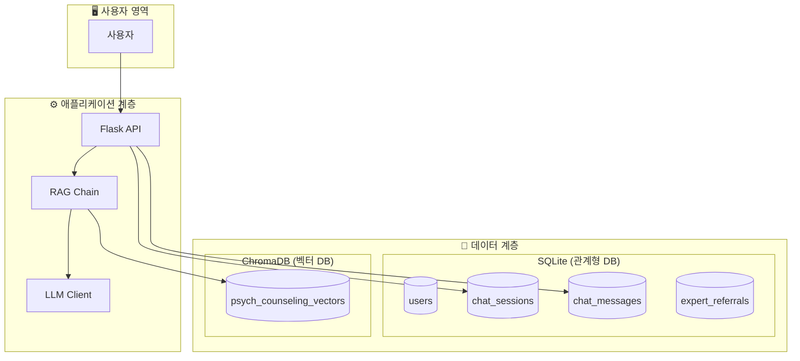
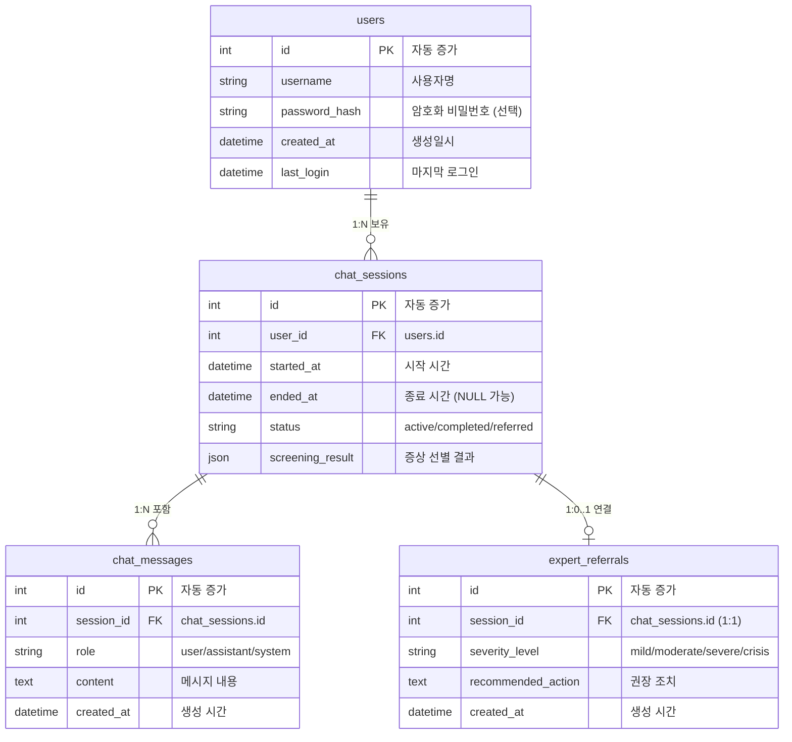
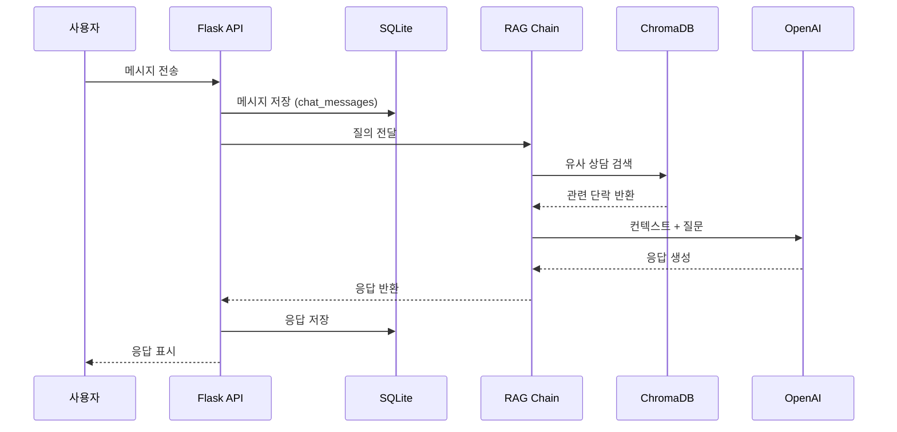

# 데이터베이스 설계 문서

---

## 1. 아키텍처 개요



---

## 2. ERD (Entity Relationship Diagram)



---

## 3. 테이블 설명

### 3.1 사용자 관련

| 테이블               | 용도        | 비고                                  |
| -------------------- | ----------- | ------------------------------------- |
| **users**            | 사용자 정보 | 익명 사용 가능                        |
| **chat_sessions**    | 채팅 세션   | 상태 추적 (active/completed/referred) |
| **chat_messages**    | 대화 기록   | role로 화자 구분                      |
| **expert_referrals** | 전문가 연결 | 세션당 최대 1회                       |

### 3.2 상담 데이터 (Vector DB)

상담 데이터는 관계형 DB(SQLite)가 아닌 **ChromaDB**에 직접 저장됩니다.

- **포맷**: JSONL (전처리됨) -> ChromaDB
- **메타데이터**: 카테고리, 화자, 심각도 등을 ChromaDB metadata 필드에 저장하여 필터링에 사용합니다.

---

## 4. 데이터 흐름



---

## 5. 주요 파일

| 파일                                                                             | 설명          |
| -------------------------------------------------------------------------------- | ------------- |
| [db_config.py](file:///c:/SKN21-3rd-3Team/config/db_config.py)                   | DB 경로 설정  |
| [database_schema.py](file:///c:/SKN21-3rd-3Team/src/database/database_schema.py) | ORM 모델 정의 |
| [vector_store.py](file:///c:/SKN21-3rd-3Team/src/database/vector_store.py)       | ChromaDB 래퍼 |
| [db_manager.py](file:///c:/SKN21-3rd-3Team/src/database/db_manager.py)           | 통합 CRUD     |

---

## 6. 사용 예시

```python
from src.database import DatabaseManager

# 초기화
db = DatabaseManager()

# 사용자 생성
user = db.create_user("test_user")

# 세션 생성
session = db.create_chat_session(user.id)

# 메시지 저장
db.add_chat_message(session.id, "user", "안녕하세요")
```

---

## 7. 부록: 아키텍처 변경 이력 (Architecture Evolution)

### 변경 내용

초기 설계에서는 상담 데이터를 **SQLite(메타데이터)**와 **ChromaDB(임베딩)**에 이중으로 저장하는 **Hybrid Storage** 방식을 고려했으나, 현재는 **ChromaDB 단일 저장** 방식으로 변경되었습니다.

### 변경 이유

1.  **복잡성 감소**: 두 저장소 간의 데이터 동기화(Sync) 로직이 불필요하게 복잡성을 증가시킴.
2.  **성능 최적화**: ChromaDB의 메타데이터 필터링 기능이 충분히 강력하여, 별도의 RDB 조인이 필요 없음.
3.  **유지보수 용이성**: 전처리된 JSONL 파일을 매개로 하여, DB 마이그레이션 없이 파일 기반으로 데이터를 관리하고 적재하는 것이 연구/개발 단계에서 더 효율적임.

### 결과

- `counseling_data`, `counseling_paragraphs` 테이블 제거
- 데이터 파이프라인 단순화: `Raw Data` -> `Preprocessor` -> `JSONL` -> `ChromaDB`
- 검색 속도 향상 및 코드 베이스 경량화 달성

```

```
