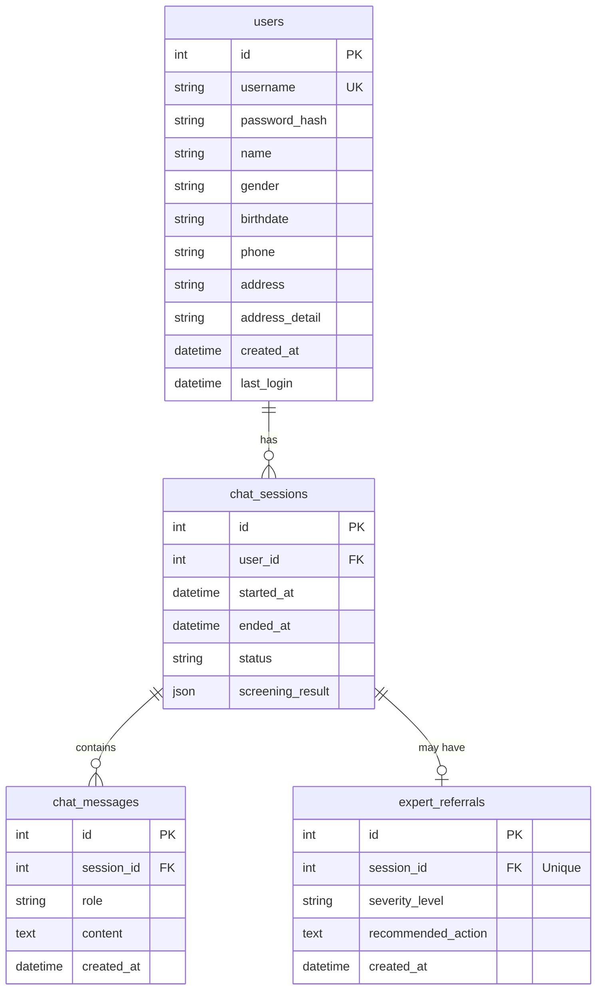

# 📊 Database ERD (Entity Relationship Diagram)

심리 상담 AI 챗봇 서비스의 데이터베이스 스키마입니다.

---

## ERD Diagram



---

## 테이블 설명

### 1. `users` (사용자)

| 컬럼           | 타입         | 설명                  |
| -------------- | ------------ | --------------------- |
| id             | INTEGER      | Primary Key           |
| username       | VARCHAR(50)  | 아이디 (Unique)       |
| password_hash  | VARCHAR(255) | Bcrypt 해시 비밀번호  |
| name           | VARCHAR(50)  | 이름                  |
| gender         | VARCHAR(10)  | 성별 (male/female)    |
| birthdate      | VARCHAR(10)  | 생년월일 (YYYY-MM-DD) |
| phone          | VARCHAR(20)  | 전화번호              |
| address        | VARCHAR(255) | 기본 주소             |
| address_detail | VARCHAR(255) | 상세 주소             |
| created_at     | DATETIME     | 생성일시              |
| last_login     | DATETIME     | 마지막 로그인         |

---

### 2. `chat_sessions` (채팅 세션)

| 컬럼             | 타입        | 설명                               |
| ---------------- | ----------- | ---------------------------------- |
| id               | INTEGER     | Primary Key                        |
| user_id          | INTEGER     | 사용자 FK                          |
| started_at       | DATETIME    | 세션 시작 시간                     |
| ended_at         | DATETIME    | 세션 종료 시간                     |
| status           | VARCHAR(20) | 상태 (active, completed, referred) |
| screening_result | JSON        | 증상 선별 결과                     |

---

### 3. `chat_messages` (채팅 메시지)

| 컬럼       | 타입        | 설명                             |
| ---------- | ----------- | -------------------------------- |
| id         | INTEGER     | Primary Key                      |
| session_id | INTEGER     | 세션 FK                          |
| role       | VARCHAR(10) | 발화자 (user, assistant, system) |
| content    | TEXT        | 메시지 내용                      |
| created_at | DATETIME    | 생성일시                         |

---

### 4. `expert_referrals` (전문가 연결)

| 컬럼               | 타입        | 설명                                    |
| ------------------ | ----------- | --------------------------------------- |
| id                 | INTEGER     | Primary Key                             |
| session_id         | INTEGER     | 세션 FK (Unique)                        |
| severity_level     | VARCHAR(20) | 심각도 (mild, moderate, severe, crisis) |
| recommended_action | TEXT        | 권장 조치                               |
| created_at         | DATETIME    | 생성일시                                |

---

## 관계도 요약

```
users (1) ──── (N) chat_sessions (1) ──── (N) chat_messages
                        │
                        └──── (0..1) expert_referrals
```

- **users ↔ chat_sessions**: 1:N (한 사용자가 여러 채팅 세션 보유)
- **chat_sessions ↔ chat_messages**: 1:N (한 세션에 여러 메시지)
- **chat_sessions ↔ expert_referrals**: 1:0..1 (세션당 최대 1개의 전문가 연결)
