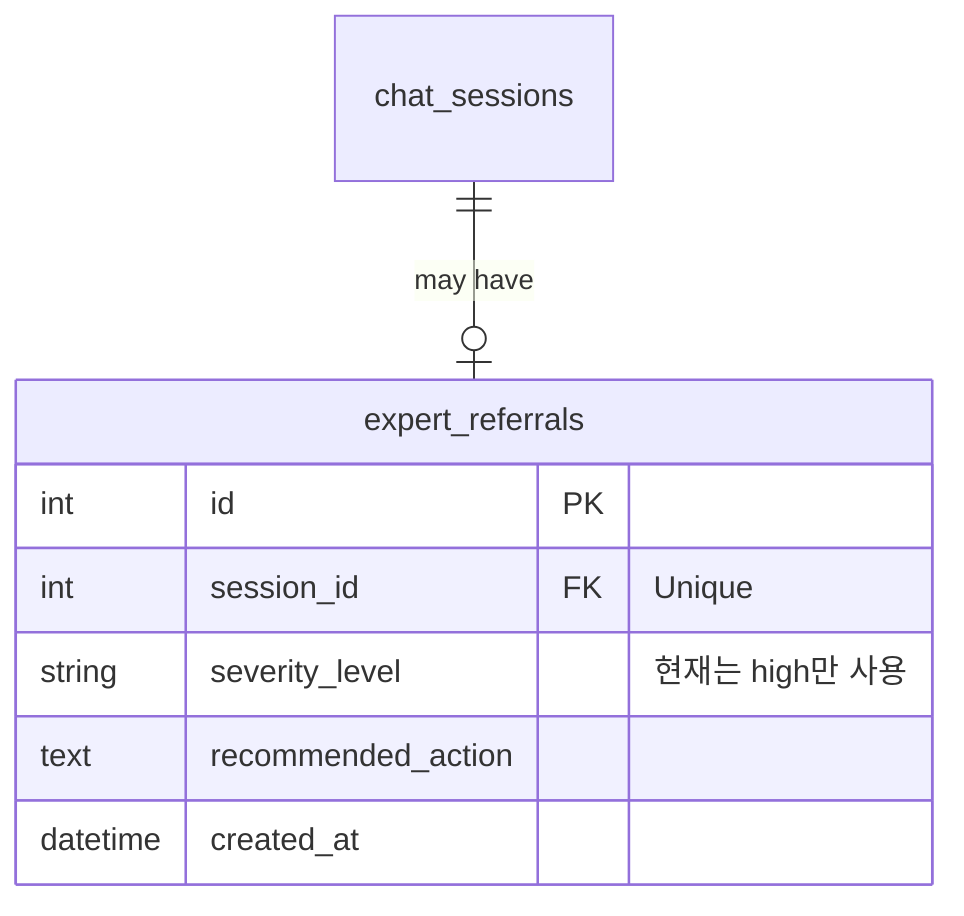

# Safety & Screening 설계 문서

심리 상담 AI 챗봇의 안전 설계 및 위험 신호 스크리닝 로직을 설명합니다.

---

## 1. 안전 설계 원칙

> ⚠️ **중요**: 본 서비스는 **의료·심리 진단 도구가 아닙니다**.

### 핵심 원칙

| 원칙          | 설명                                         |
| ------------- | -------------------------------------------- |
| **비진단**    | 의학적/심리학적 진단을 내리지 않음           |
| **즉시 연결** | 위험 신호 감지 시 전문 기관 안내             |
| **투명성**    | AI 응답임을 명확히 고지                      |
| **익명성**    | 모든 상담 데이터는 익명화된 공개 데이터 사용 |

---

## 2. 현재 구현된 안전 기능

### 2.1 프롬프트 기반 위험 요청 거부

`answer.py`의 시스템 프롬프트에서 위험한 요청을 거부하도록 설정:

```python
# SYSTEM_PROMPT 중 일부
[위험한 요청]
자해, 타해, 폭력 방법 요청 → 그건 도움이 되지 않아요.
이후 사용자가 할 수 있을거야, 해줘 등 재요청 → 도와드리기 어려워요.
```

### 2.2 LLM 판단 기반 전문가 연결 태그

GPT-4o에게 위험 상황 판단을 위임:

```python
# answer.py (line 138)
위 문서를 바탕으로 사용자 질문에 답변해주고,
사용자의 자살 위험이 높거나 전문적인 상담이 필요하다고 판단되면
답변 끝에 "[EXPERT_REFERRAL_NEEDED]" 태그를 붙여줘.
```

### 2.3 전문가 연결 DB 기록

`[EXPERT_REFERRAL_NEEDED]` 태그 감지 시 `expert_referrals` 테이블에 자동 기록:

```python
# chain.py (line 156-161)
if "[EXPERT_REFERRAL_NEEDED]" in answer:
    answer = answer.replace("[EXPERT_REFERRAL_NEEDED]", "").strip()
    self._handle_expert_referral(session_id, answer)
```

```python
# chain.py (line 216-225)
def _handle_expert_referral(self, session_id: int, answer: str):
    self.db.create_expert_referral(
        session_id=session_id,
        severity_level="high",
        recommended_action="전문 상담사 연결 권장"
    )
```

---

## 3. 데이터베이스 연동

### 3.1 expert_referrals 테이블



---

## 4. 제한사항

| 항목       | 내용                                               |
| ---------- | -------------------------------------------------- |
| **범위**   | AI는 정서적 지지 제공, 진단/치료는 불가            |
| **한계**   | LLM 판단에 의존하므로 100% 정확한 위험 감지 불가능 |
| **데이터** | 익명화된 공개 데이터만 학습에 사용                 |

---

## 5. 향후 구현 예정 (미구현)

| 기능                  | 설명                                                            |
| --------------------- | --------------------------------------------------------------- |
| 명시적 키워드 탐지    | `["자살", "자해", "죽고 싶"]` 등 고위험 키워드 리스트 기반 탐지 |
| Severity 단계 분류    | mild / moderate / severe / crisis 4단계 분류                    |
| 안전 메시지 템플릿    | 위기 상황별 안내 메시지 및 연락처 자동 출력                     |
| 전문 기관 연락처 안내 | 자살예방상담전화 1393, 정신건강위기상담전화 1577-0199 등        |

---

## 6. 관련 파일

| 파일                                                                             | 설명                                   |
| -------------------------------------------------------------------------------- | -------------------------------------- |
| [answer.py](file:///c:/SKN21-3rd-3Team/src/rag/answer.py)                        | 시스템 프롬프트 및 위험 요청 거부 로직 |
| [chain.py](file:///c:/SKN21-3rd-3Team/src/rag/chain.py)                          | 전문가 연결 태그 감지 및 DB 기록       |
| [db_manager.py](file:///c:/SKN21-3rd-3Team/src/database/db_manager.py)           | expert_referrals CRUD                  |
| [database_schema.py](file:///c:/SKN21-3rd-3Team/src/database/database_schema.py) | ExpertReferral 스키마                  |
