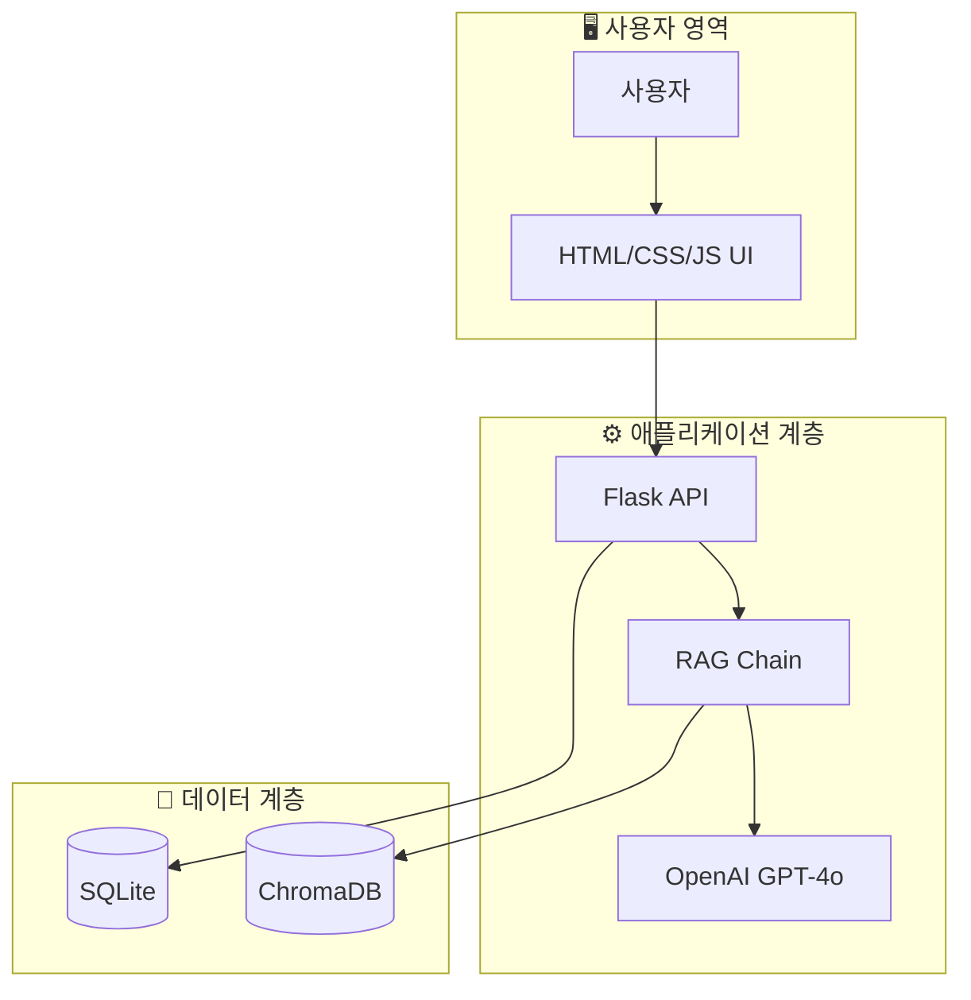
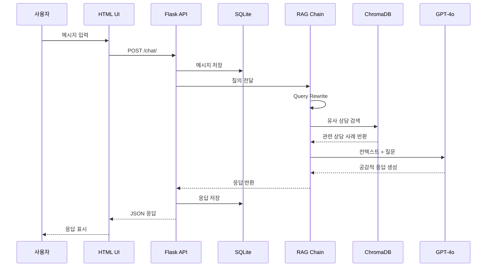

# 시스템 아키텍처

## RAG 시스템 구성도

## 구성 요소

### 1. 데이터 수집 및 전처리

- **역할**: 원본 상담 데이터를 수집하고 발화 단위로 청킹하여 임베딩 가능한 형태로 변환
- **기술**: Python, LangChain TextSplitter
- **주요 파일**: `src/data/preprocess_data.py`, `src/data/embed_to_vectordb.py`

### 2. Vector Database (ChromaDB)

- **역할**: 임베딩된 상담 발화를 저장하고 유사도 검색 수행
- **기술**: ChromaDB + OpenAI Embedding (`text-embedding-3-small`)
- **주요 파일**: `src/database/vector_store.py`

### 3. Retriever

- **역할**: 사용자 질문과 유사한 상담 사례 검색 (Similarity 기반)
- **기술**: LangChain Retriever
- **주요 파일**: `src/rag/retriever.py`

### 4. LLM

- **역할**: 검색된 상담 컨텍스트를 기반으로 공감적 답변 생성
- **기술**: OpenAI GPT-4o
- **주요 파일**: `src/rag/answer.py`

### 5. RAG Chain

- **역할**: Query Rewrite → Retriever → Answer 생성 파이프라인 구성
- **기술**: LangChain
- **주요 파일**: `src/rag/chain.py`, `src/rag/rewrite.py`

### 6. Backend API (Flask)

- **역할**: 사용자 요청 처리, 세션 관리, 채팅 기록 저장
- **기술**: Flask, SQLAlchemy
- **주요 파일**: `app/main.py`

### 7. Frontend UI

- **역할**: 사용자 인터페이스 제공 (채팅, 로그인, 설문 등)
- **기술**: HTML5, CSS3, JavaScript (Vanilla)
- **주요 파일**: `app/templates/`, `app/static/`

## 데이터 흐름

## 관련 문서

| 문서                                         | 설명                      |
| -------------------------------------------- | ------------------------- |
| [DATABASE_DESIGN.md](./DATABASE_DESIGN.md)   | DB 스키마 및 ERD          |
| [data_collection.md](./data_collection.md)   | 데이터 수집/임베딩 가이드 |
| [GUIDE\_전처리.md](./GUIDE_전처리.md)        | 전처리 상세 가이드        |
| [SAFETY_SCREENING.md](./SAFETY_SCREENING.md) | 안전 스크리닝 설계        |
